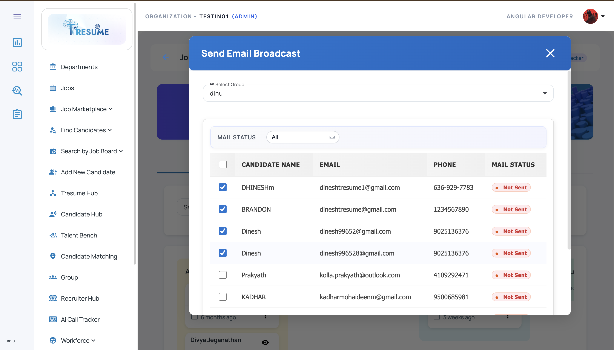
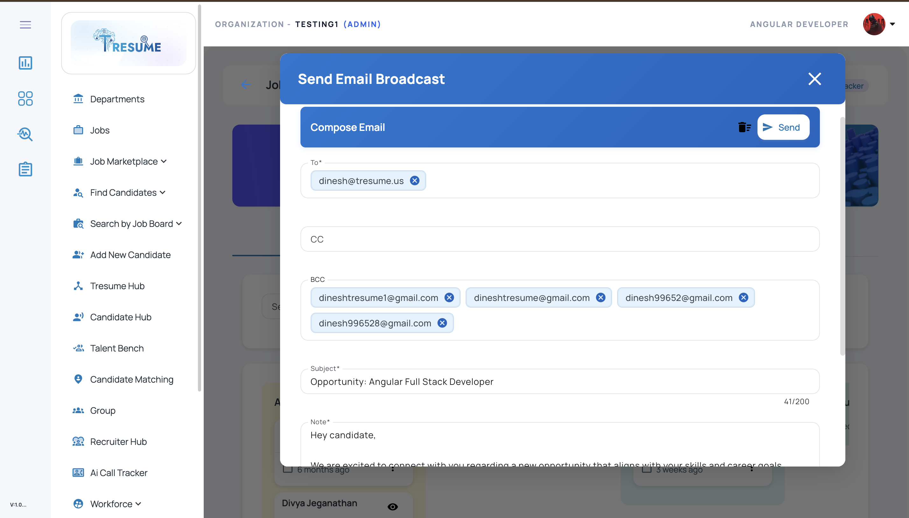
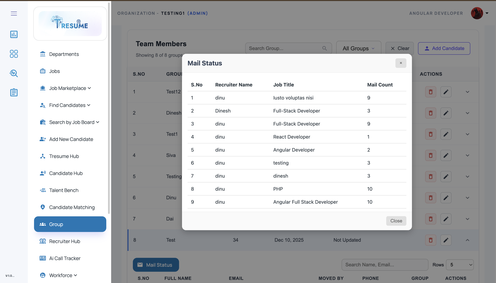

# Bulk Email Broadcast

A **bulk email broadcast module** built with **Angular**, **Node.js**, and **Microsoft SQL Server** for sending job-related emails to selected candidates inside an ATS / recruitment workflow.

This module allows recruiters to select candidates from a candidate matching or candidate management screen and send a broadcast email with job details, recruiter notes, and candidate-specific targeting.

---

## 🚀 Overview

The **Bulk Email Broadcast** module is designed for recruiter workflows where multiple shortlisted or matched candidates need to receive the same email communication about a job opening, follow-up, interview process, or outreach campaign.

Instead of manually sending emails one by one, recruiters can:

* select multiple candidates using checkboxes
* auto-fill email recipients / BCC
* inject job title and job description into the message
* compose recruiter notes
* send a single broadcast to all selected candidates

This module is useful for **ATS platforms, candidate matching workflows, recruiter outreach systems, and hiring communication tools**.

---

## ✨ Features

## 1) Candidate Selection Based Email Sending

Recruiters can:

* select one or more candidates from a list
* trigger email sending only for selected candidates
* avoid sending to the entire matched candidate pool

---

## 2) Auto BCC Population

The module automatically collects selected candidate email addresses and:

* populates the **BCC** field
* supports recruiter-side bulk communication flow
* reduces manual copy/paste effort

---

## 3) Job-Aware Email Composition

The email composer can automatically prefill:

* **email subject** using job details
* **job description / note section**
* recruiter note or message body context

This helps standardize outreach emails and improves recruiter productivity.

---

## 4) Recruiter Email Composer UI

A recruiter can review and edit:

* **To / From / BCC**
* email subject
* job description / recruiter note
* selected candidate count
* final message content before sending

---

## 5) Broadcast Payload Generation

The frontend can build a clean payload with:

* selected candidate IDs
* selected email addresses
* job ID / job title
* recruiter note
* message subject / content

The backend uses this payload to send the email broadcast.

---

## 🛠️ Tech Stack

### Frontend

* **Angular**
* **TypeScript**
* **HTML5**
* **SCSS / CSS**
* **Angular Material**

### Backend

* **Node.js**
* **Express.js**
* **Email service integration** (SMTP / SendGrid / provider-based email sender)

### Database

* **Microsoft SQL Server**

---

## 📂 Project Structure

```bash
bulk-email-broadcast/
│
├── frontend/                                 # Angular application
│   ├── src/
│   │   ├── app/
│   │   │   ├── components/
│   │   │   │   ├── candidate-list/
│   │   │   │   ├── email-composer/
│   │   │   │   └── email-preview/
│   │   │   ├── services/
│   │   │   ├── models/
│   │   │   └── shared/
│   │   ├── assets/
│   │   └── environments/
│   └── angular.json
│
├── backend/                                  # Node.js / Express backend
│   ├── routes/
│   ├── controllers/
│   ├── services/
│   ├── db/
│   ├── config/
│   └── server.js
│
├── database/
│   └── schema.sql
│
├── screenshots/
│   ├── candidate-selection.png
│   ├── email-composer.png
│   └── broadcast-preview.png
│
└── README.md
```

---

## 🖥️ Core UI Screens

## 1. Candidate Selection Screen

Displays a candidate list with:

* checkbox selection
* candidate name / email
* recruiter selection flow
* selected candidate count

---

## 2. Email Composer Modal / Form

Displays the email broadcast UI with:

* BCC auto-populated from selected candidates
* subject auto-filled from job details
* recruiter note / job description
* send action

---

## 3. Broadcast Preview / Confirmation

Optional review screen showing:

* selected recipients
* email subject
* message body / note
* job information summary

---

## 📸 Screenshots

### Candidate Selection



### Email Composer



### Broadcast Preview



> Create a folder named **`screenshots`** in the repo root and add your screenshots using these names:

* `candidate-selection.png`
* `email-composer.png`
* `broadcast-preview.png`

---

## 🔄 Typical Workflow

1. Recruiter opens candidate list / candidate matching screen
2. Selects candidates using checkboxes
3. Clicks **Send Email / Broadcast**
4. Selected candidate email addresses are collected
5. **BCC** is auto-populated with selected candidate emails
6. Job details are injected into the **subject** and **note** section
7. Recruiter edits message if needed
8. Clicks **Send**
9. Backend sends broadcast email to selected recipients only

---

## 🧪 Example Broadcast Payload

```json
{
  "jobId": 1024,
  "jobTitle": "Angular Developer",
  "subject": "Opportunity for Angular Developer Role",
  "note": "Please find the job details below and let us know your interest.",
  "candidateIds": [12, 25, 31],
  "bccEmails": [
    "candidate1@example.com",
    "candidate2@example.com",
    "candidate3@example.com"
  ]
}
```

---

## 🗄️ Example SQL Table Structure

### Email Broadcast Log Table

```sql
CREATE TABLE EmailBroadcastLog (
    BroadcastId INT IDENTITY(1,1) PRIMARY KEY,
    JobId INT NULL,
    Subject NVARCHAR(255),
    Note NVARCHAR(MAX),
    SentBy INT NULL,
    CandidateCount INT DEFAULT 0,
    CreatedAt DATETIME DEFAULT GETDATE()
);
```

### Email Broadcast Recipients Table

```sql
CREATE TABLE EmailBroadcastRecipients (
    RecipientId INT IDENTITY(1,1) PRIMARY KEY,
    BroadcastId INT NOT NULL,
    CandidateId INT NULL,
    Email NVARCHAR(255),
    Status NVARCHAR(50) DEFAULT 'PENDING',
    FOREIGN KEY (BroadcastId) REFERENCES EmailBroadcastLog(BroadcastId)
);
```

---

## ⚙️ Setup Instructions

## 1) Clone the repository

```bash
git clone https://github.com/YOUR-USERNAME/bulk-email-broadcast.git
cd bulk-email-broadcast
```

---

## 2) Frontend setup (Angular)

```bash
cd frontend
npm install
ng serve
```

Open in browser:

```bash
http://localhost:4200
```

---

## 3) Backend setup (Node.js)

```bash
cd backend
npm install
npm start
```

---

## 4) Database setup (Microsoft SQL Server)

* Create a SQL Server database
* Run the schema file inside the `database/` folder
* Update SQL connection config in backend

Example config:

```js
const config = {
  user: "your_sql_username",
  password: "your_sql_password",
  server: "localhost",
  database: "EMAIL_BROADCAST_DB",
  options: {
    trustServerCertificate: true
  }
};
```

---

## 🔌 Example API Endpoints

* `POST /api/email/broadcast` → send bulk email to selected candidates
* `POST /api/email/preview` → preview email payload before sending
* `GET /api/email/broadcast/:id` → fetch broadcast log
* `GET /api/email/broadcast/:id/recipients` → fetch recipients and delivery status

---

## 📈 Use Cases

This project can be used as a demo / reference implementation for:

* ATS recruiter outreach workflows
* candidate broadcast communication
* bulk interview invitation emails
* job campaign communication
* internal recruiter email tools

---

## 🔒 Important Note

This repository should be published as a **demo / showcase version** only.
Do **not** upload:

* real candidate email addresses
* real SMTP / email provider credentials
* internal recruiter mail data
* company email secrets
* `.env` files with private keys

Use **mock / sanitized candidate data** for public GitHub uploads.

---

## 🚀 Future Improvements

* email template builder
* send test email option
* email delivery status tracking
* open / click analytics
* attachment support
* schedule email broadcast
* recruiter template library
* follow-up reminder automation

---

## 👨‍💻 Author

**Dinesh M**
Software Developer | Angular · Node.js · Microsoft SQL Server · ATS / HRMS · AI Automation

* GitHub: https://github.com/Dinesh-T-2005
* LinkedIn: https://www.linkedin.com/in/dinesh-m-a5698b330/
* Email: [dinesh996528@gmail.com](mailto:dinesh996528@gmail.com)

---

## 📄 License

This project is shared for learning, demonstration, and portfolio purposes.
